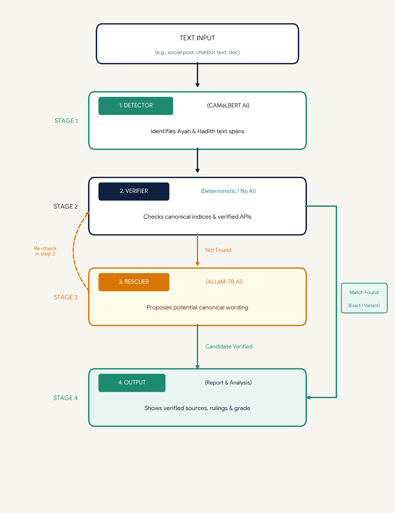

# مُحقِّق — Muhaqiq

**أداة تحقّق من الاستشهادات القرآنية والأحاديث في أي نص: تكتشفها، وتقارنها حرفيًا بمصادرها، وتُظهر الحكم والمصدر والفرق — ولا تحكم بنفسها على شيء لم تجده.**

Muhaqiq finds Quran and hadith citations in any text (a chatbot answer, a tweet, an article, a text file), checks each one **literally** against the sources, and shows the verdict, the source, the scholars' grading, and a word-level diff. The AI widens recall and explains; the sources decide.


- **Website:** https://rahafawwad.github.io/muhaqiq/
- **Live API:** `https://rahafawwad--muhaqiq-span-detector-web.modal.run/verify`
- **Chrome extension:** `extension/` (load unpacked)
- **Models:** [`muhaqiq/muhaqiq-span-detector`](https://huggingface.co/muhaqiq/muhaqiq-span-detector) · [`muhaqiq/muhaqiq-allam-restorer`](https://huggingface.co/muhaqiq/muhaqiq-allam-restorer) · [`muhaqiq/muhaqiq-relevance`](https://huggingface.co/muhaqiq/muhaqiq-relevance) · try the detector: [Space](https://huggingface.co/spaces/RahafAwwad/muhaqiq-span-detector)

---

## The four marks

| Mark | Meaning | How it is decided |
|---|---|---|
| 🟢 **مطابق** | the quoted wording exists in the source | normalised quote contained in the source text, or ≥ 99.5 % (ayah) / ≥ 97 % (hadith) similarity to a window of it — orthographic differences only |
| 🟡 **لفظ مختلف** | a source text is close, but the wording differs | ≥ 80 % window similarity; the canonical wording and a word diff are shown. Not called "تحريف": narration by meaning is a recognised practice |
| 🔴 **لم نجده** | nothing close enough in the sources we searched | the search log is shown; the user can ask a scholar. We never say "fabricated" — only that we did not find it |
| 🔵 **يحتاج مراجعة** | not enough to assert either way | a restorer proposal that resembles the quote but not closely enough; a 2–4-word fragment of a longer text; or dorar.net was unreachable (we never give a verdict from partial data) |

Every citation also carries: the source link, **every scholar's ruling on that wording** (quoted from dorar.net, never generated), **المصدر المذكور** (does "رواه البخاري" / "[البقرة: 31]" match where the text was actually found?), an **اقتباس جزئي** flag when a fragment is cut from a longer ayah/matn, **اقتباس مع حذف** when a quote skips words with «...» (each part is matched in order and the left-out words are shown), links to the same text in other languages (quran.com, hadeethenc), and the full search log.

## What the AI never does

1. No model decides whether a quote is authentic or correct — only literal comparison with sources does.
2. No model produces a hadith grade — grades are quoted verbatim from dorar.net / hadeethenc, with the scholar's name.
3. Nothing a language model writes is shown unless the source confirms it word for word.
4. Abstention is a first-class outcome (لم نجده), and personal-case questions are referred to scholars, not answered.
5. No model labels a question as "contested" (خلافية): that note appears only when a retrieved fatwa itself says so, with its link.

**«دليل واحد» mode** (website checkbox; the extension's right-click): the whole input is checked as one ayah/hadith, skipping detection — for quotes the detector misses.


## Architecture



Serving: detector + verifier + notes on a CPU container (Modal); ALLaM on an A10G GPU container that scales to zero (Modal). Both are plain JSON endpoints with CORS, called by the extension and the website.

## Models and results

### 1. Citation span detector — `muhaqiq/muhaqiq-span-detector`
CAMeLBERT-MSA fine-tuned for token classification (BIO over AYAH / ISNAD / MATN / SOURCE) on IslamicEval 2026 Subtask 1 train (4,706 answers, 32,548 spans).

| metric (dev, 484 answers) | value |
|---|---|
| official Subtask 1 metric — character-level macro-F1 over 5 classes | **0.960** |
| per class: neither / Ayah / matn / isnad / claimed_source | 0.993 / 0.993 / 0.977 / 0.886 / 0.949 |
| strict span F1 (exact boundaries, 4 labels) | 0.905 |

Spans are word-level; pieces of one quote are joined, and edges are repaired against the source (a word the detector dropped is restored only if the source continues with exactly that word).

### 2. Verifier — `tools/verify.py` (no model)
Evaluated against the annotators' `correct` / `incorrect` status on IslamicEval dev spans. On a 100+100 sample after normalisation fixes:

| | false alarm on gold-correct | wrongly approved gold-incorrect |
|---|---|---|
| ayat | 0 / 41 | 0 / 59 (after per-label thresholds) |
| hadith | 2 / 19 (variant narrations dorar did not return) | 1 / 81 (a real hadith with a wrong attribution — now caught by the source check) |

### 3. Restorer — `muhaqiq/muhaqiq-allam-restorer`
ALLaM-7B-Instruct + QLoRA (r=16, all linear layers), trained on 22,168 pairs: IslamicEval `incorrect` spans → their gold `correction`, `correct` spans → themselves, fabricated spans → empty (teaches abstention), plus synthetic corruptions of real ayat and matns. One epoch, A10G, 2 h 11 min; train loss 0.417, token accuracy 0.926.

Example: «إن الله لا ينظر إلى الجسد ولكنه ينظر إلى القلب» — retrieval alone: لم نجده (76). Restorer proposal: «إِنَّ اللهَ لَا يَنْظُرُ إِلَى صُوَرِكُمْ وَأَمْوَالِكُمْ وَلَكِنْ يَنْظُرُ إِلَى قُلُوبِكُمْ وَأَعْمَالِكُمْ» → verified in صحيح مسلم → shown as a review candidate with the diff.

### 4. Relevance note (experimental) — `muhaqiq/muhaqiq-relevance`
CAMeLBERT cross-encoder on (question, citation) from IslamicEval Subtask 4 (6,231 train pairs, 84 % positive; 282 dev pairs, 54 % positive). Class-weighted loss, selected on macro-F1. **Dev macro-F1 0.61, accuracy 0.61.** It does not separate related from unrelated reliably (a wudu question with the frog hadith scores 0.84), so it is shown only as a number marked «تجريبي» in expert mode — never as a label — and reported here as a baseline. Improving it is listed under next steps.

## Data and sources

**Training data:** IslamicEval 2026 shared task — Subtask 1 (citation spans), Subtask 2 (correct / incorrect status + corrections), Subtask 4 (question–citation relevance).

**Base models:** [CAMeLBERT-MSA](https://huggingface.co/CAMeL-Lab/bert-base-arabic-camelbert-msa) (detector, relevance) · [ALLaM-7B-Instruct](https://huggingface.co/ALLaM-AI/ALLaM-7B-Instruct-preview) (restorer).

**Sources checked at run time** (Muhaqiq only quotes them, with a link back):

| Source | Used for |
|---|---|
| [Quran.com](https://quran.com) — [API v4](https://api-docs.quran.com) | Quran text (Uthmani + simple), translations |
| [الدرر السنية — dorar.net](https://dorar.net/hadith) — [API](https://dorar.net/article/389) | hadith texts and every scholar's ruling |
| [موسوعة الأحاديث النبوية — HadeethEnc](https://hadeethenc.com) | hadith, attribution, grade, explanation (الشرح), translations |
| [Tavily](https://tavily.com), restricted to approved sites ([islamqa.info](https://islamqa.info), [binbaz.org.sa](https://binbaz.org.sa), [binothaimeen.net](https://binothaimeen.net), [islamweb.net](https://www.islamweb.net)) | closest trusted answers to a user's question |

## Run it

```bash
git clone https://github.com/RahafAwwad/muhaqiq && cd muhaqiq
conda create -n muhaqiq python=3.12 -y && conda activate muhaqiq && pip install -r requirements.txt
python tools/quran.py build && python tools/hadeethenc.py build       # local indexes (one-off)
python tools/verify.py                                                   # 5 test cases
modal secret create muhaqiq-keys TAVILY_KEY=... LLM_URL=...  # private keys stored on Modal, never in the code (only to deploy your own copy)
modal deploy api/llm_modal.py && modal deploy api/modal_app.py           # GPU model, then the API
```
API: `POST /verify {"text": "...", "question": "...", "single": false}` → `{summary, citations[], related, disclosure}` (schema in `api/README.md`).
Extension: `chrome://extensions` → Developer mode → Load unpacked → `extension/`. Website: the GitHub Pages URL, or locally `cd web && python3 -m http.server` (add `?api=<url>` to test another API).

## Use it in your own site or app

The API is open (CORS enabled): any page can send text and show the result.

```js
const r = await fetch("https://rahafawwad--muhaqiq-span-detector-web.modal.run/verify", {
  method: "POST", headers: { "Content-Type": "application/json" },
  body: JSON.stringify({ text: "قال النبي ﷺ: إنما الأعمال بالنيات. رواه الترمذي" })   // add "single": true for one quote
});
const { summary, citations } = await r.json();   // each citation: text, verdict, source{…, url}, rulings, attribution
```
For the same cards as the website, include [`web/render.js`](web/render.js) and call `MQ.card(citation, "general", i)`.
The first request after a quiet period takes longer while the server wakes up.

## Repository map
`encoder/` detector training + official evaluation · `tools/` verifier, sources, rescue, recommender, relevance · `api/` Modal endpoints · `train/` restorer QLoRA · `data/` dataset builders · `extension/` Chrome MV3 · `web/` site.

## Licence
Code: Apache-2.0. Source content belongs to its publishers; Muhaqiq displays it with attribution and links, and does not modify it.